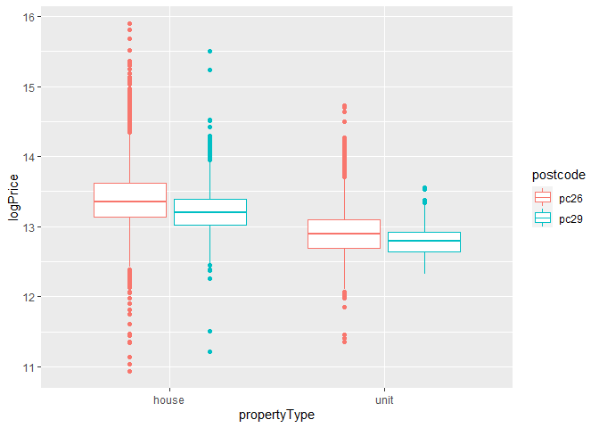
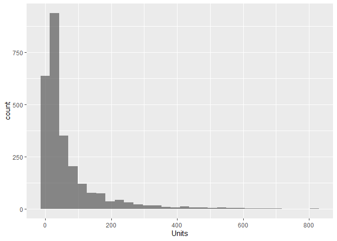
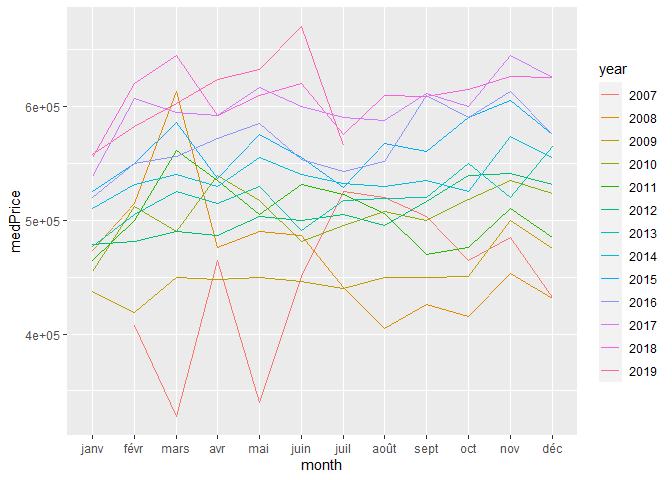
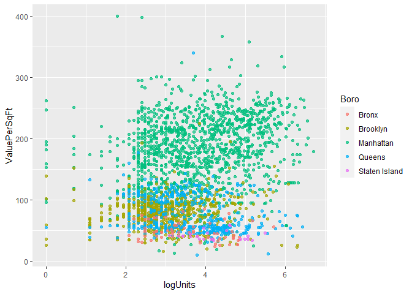

House price project
================
Adrien Riaux
01/08/2022

# House price project

``` r
#Import 
library(dplyr)
```

    ## Warning: le package 'dplyr' a été compilé avec la version R 4.1.3

    ## 
    ## Attachement du package : 'dplyr'

    ## Les objets suivants sont masqués depuis 'package:stats':
    ## 
    ##     filter, lag

    ## Les objets suivants sont masqués depuis 'package:base':
    ## 
    ##     intersect, setdiff, setequal, union

``` r
library(tidyr)
```

    ## Warning: le package 'tidyr' a été compilé avec la version R 4.1.2

``` r
library(ggplot2)
```

    ## Warning: le package 'ggplot2' a été compilé avec la version R 4.1.2

``` r
library(lubridate)
```

    ## Warning: le package 'lubridate' a été compilé avec la version R 4.1.2

    ## 
    ## Attachement du package : 'lubridate'

    ## Les objets suivants sont masqués depuis 'package:base':
    ## 
    ##     date, intersect, setdiff, union

We have several columns : - datesold : date of the property sale -
postcode : postal code of the property - price : sale price of the
property - propertyType : unit or house - bedrooms : number of bedrooms
per property

``` r
#Read data
df = read.csv("house_price.csv", header = TRUE, sep = ",")
head(df)
```

    ##              datesold postcode  price propertyType bedrooms
    ## 1 2007-02-07 00:00:00     2607 525000        house        4
    ## 2 2007-02-27 00:00:00     2906 290000        house        3
    ## 3 2007-03-07 00:00:00     2905 328000        house        3
    ## 4 2007-03-09 00:00:00     2905 380000        house        4
    ## 5 2007-03-21 00:00:00     2906 310000        house        3
    ## 6 2007-04-04 00:00:00     2905 465000        house        4

We can observe that our dataframe contains date, but there store as
characters. Moreover, it seems that the propertyType and bedrooms
columns are categorical features. To verify that, we observe the number
of unique value for these features.

``` r
#Check unique value of categorical features
for (i in c("propertyType", "bedrooms")) {
  print(unique(df[,i]))
}
```

    ## [1] "house" "unit" 
    ## [1] 4 3 5 1 2 0

Well, we have only to possible values for properyType and 6 for
bedrooms. Use propertyType as factor would be interesting but we will
keep bedrooms as int, because there are an order in this features. Have
3 bedrooms is better than only 2 for example.

So we can now convert propertyType and datesold features into
appropriate types.

``` r
#Convert type
df[, "propertyType"] <- as.factor(df[, "propertyType"])
df[, "datesold"] <- as.Date(df[, "datesold"])

sapply(df, class)
```

    ##     datesold     postcode        price propertyType     bedrooms 
    ##       "Date"    "integer"    "integer"     "factor"    "integer"

``` r
#Data description
summary(df)
```

    ##     datesold             postcode        price         propertyType 
    ##  Min.   :2007-02-07   Min.   :2600   Min.   :  56500   house:24552  
    ##  1st Qu.:2013-02-05   1st Qu.:2607   1st Qu.: 440000   unit : 5028  
    ##  Median :2015-09-30   Median :2615   Median : 550000                
    ##  Mean   :2015-02-21   Mean   :2730   Mean   : 609736                
    ##  3rd Qu.:2017-07-26   3rd Qu.:2905   3rd Qu.: 705000                
    ##  Max.   :2019-07-27   Max.   :2914   Max.   :8000000                
    ##     bedrooms   
    ##  Min.   :0.00  
    ##  1st Qu.:3.00  
    ##  Median :3.00  
    ##  Mean   :3.25  
    ##  3rd Qu.:4.00  
    ##  Max.   :5.00

We have no null values in the dataframe. Moreover postcode is only 4
digits reference, we don’t expect that this data will be useful in this
form. We will probably transform it into a categorical class.

### Exploratory data analysis

``` r
#Plot density of postcode per propertyType
ggplot(data = df, aes(x = postcode)) + #Add histogram
  geom_histogram(aes(
    y = ..density.., 
    fill = propertyType, 
    color = propertyType
  ), 
  alpha = 0.3, position = "identity") + 
  geom_density(aes(color = propertyType), size = 0.7)
```

    ## `stat_bin()` using `bins = 30`. Pick better value with `binwidth`.

<!-- --> We have
two group of postcode. But neither match with a propertyType. It could
be interesting to create a categorical feature for the postcode and
check if they are a place where the price is higher. It can be
interpreted like neighbourhoods.

``` r
#Create a categorical feature
df <- df %>% mutate(postcode = case_when(postcode > 2800 ~ "pc29",
                                         TRUE ~ "pc26"))

#Convert type
df[, "postcode"] <- as.factor(df[, "postcode"])
```

Now we can visualize price per propertyType and postcode.

``` r
#Price boxplot
ggplot(data = df, aes(x = propertyType, y = price)) + geom_boxplot(aes(color = postcode))
```

<!-- -->

``` r
#Remove outliers (price higher than 2 000 000$)
df <- df %>% filter(price < 2e+06)

#Plot again price boxplot
ggplot(data = df, aes(x = propertyType, y = price)) + geom_boxplot(aes(color = postcode))
```

<!-- -->

It seems that property with postcode start with 26 are little more
expensive than the others, but it still have an overlap between the two
neighbourhoods.

Another interesting graphic is price against number of bedrooms.

``` r
#Price against bedrooms
ggplot(df, aes(x = factor(bedrooms), y = price)) + 
  geom_boxplot(alpha = 0.3) +
  labs(x = "number of bedrooms")
```

<!-- -->

Another important graphic is the correlation heatmap. It shows the
correlation between features, i.e. we need to test price and bedrooms
relationship with each other.

``` r
#Create a correlation matrix
corr_df <- df %>% select(c("price", "bedrooms")) %>% cor()
corr_df
```

    ##              price  bedrooms
    ## price    1.0000000 0.5326027
    ## bedrooms 0.5326027 1.0000000

``` r
#Create month and year columns
df$year <- year(df$datesold)
df$month <- month(df$datesold, label = TRUE)

#Plot all sells per month and year
ggplot(df, aes(x = month, y = price)) +
  geom_point(aes(color = factor(year))) + 
  facet_wrap(~year) +
  theme(axis.text.x = element_text(angle = 90)) +
  scale_color_discrete(name = "year")
```

<!-- -->

``` r
#Reshape data by year and month and calculate the price average
df_time <- df %>% group_by(year, month) %>% summarize(medPrice = median(price))
```

    ## `summarise()` has grouped output by 'year'. You can override using the
    ## `.groups` argument.

``` r
#Plot price evolution per month
ggplot(df_time, aes(x = month, y = medPrice)) +
  geom_line(aes(color = factor(year), group = year)) +
  scale_color_discrete(name = "year")
```

<!-- -->

``` r
#Reshape data by year
df_time <- df %>% group_by(year, postcode) %>% summarize(medPrice = median(price))
```

    ## `summarise()` has grouped output by 'year'. You can override using the
    ## `.groups` argument.

``` r
ggplot(df_time, aes(x = year, y = medPrice)) +
  geom_line(aes(color = postcode))
```

<!-- -->

### Modeling
