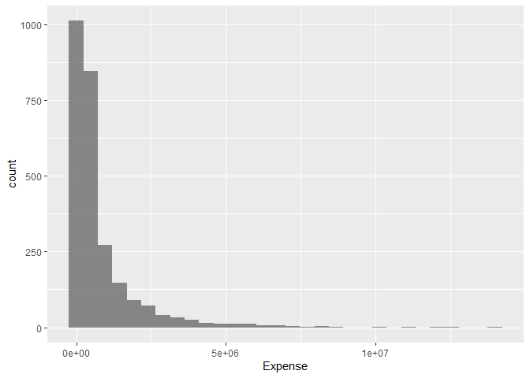
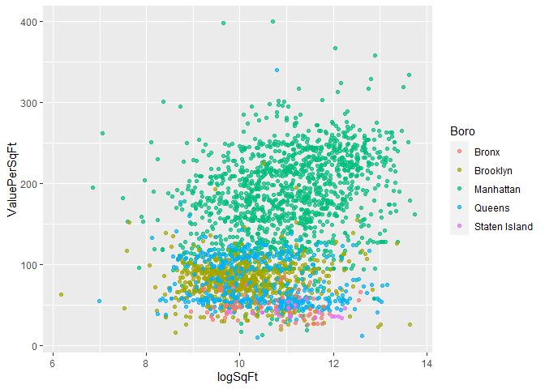
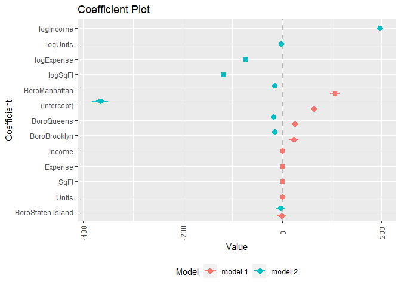

House price project
================
Adrien Riaux
01/08/2022

# House price project

``` r
#Import 
library(dplyr)
```

    ## Warning: le package 'dplyr' a été compilé avec la version R 4.1.3

    ## 
    ## Attachement du package : 'dplyr'

    ## Les objets suivants sont masqués depuis 'package:stats':
    ## 
    ##     filter, lag

    ## Les objets suivants sont masqués depuis 'package:base':
    ## 
    ##     intersect, setdiff, setequal, union

``` r
library(tidyr)
```

    ## Warning: le package 'tidyr' a été compilé avec la version R 4.1.2

``` r
library(ggplot2)
```

    ## Warning: le package 'ggplot2' a été compilé avec la version R 4.1.2

``` r
library(coefplot)
```

    ## Warning: le package 'coefplot' a été compilé avec la version R 4.1.3

We have several columns : - datesold : date of the property sale -
postcode : postal code of the property - price : sale price of the
property - propertyType : unit or house - bedrooms : number of bedrooms
per property

``` r
#Read data
df = read.csv("house_price.csv", header = TRUE, sep = ",")
head(df)
```

    ##   Units   SqFt   Income Expense ValuePerSqFt      Boro
    ## 1    42  36500  1332615  342005       200.00 Manhattan
    ## 2    78 126420  6633257 1762295       242.76 Manhattan
    ## 3   500 554174 17310000 3543000       164.15 Manhattan
    ## 4   282 249076 11776313 2784670       271.23 Manhattan
    ## 5   239 219495 10004582 2783197       247.48 Manhattan
    ## 6   133 139719  5127687 1497788       191.37 Manhattan

We can observe that our dataframe several informations. For these data
the response is the value per square foot and the predictors are
everything else.

Moreover, it seems that the Boro column is categorical features. To
verify that, we observe the number of unique value for these features.

``` r
#Check unique value of categorical features
print(unique(df[,"Boro"]))
```

    ## [1] "Manhattan"     "Brooklyn"      "Queens"        "Bronx"        
    ## [5] "Staten Island"

Well, we have only five possible values for Boro column. Use Boro as
factor would be interesting.

So we can now convert Boro feature into an appropriate type.

``` r
#Convert type
df[, "Boro"] <- as.factor(df[, "Boro"])
sapply(df, class)
```

    ##        Units         SqFt       Income      Expense ValuePerSqFt         Boro 
    ##    "integer"    "integer"    "integer"    "integer"    "numeric"     "factor"

``` r
#Data description
summary(df)
```

    ##      Units              SqFt             Income            Expense        
    ##  Min.   :   1.00   Min.   :    478   Min.   :    6424   Min.   :    1740  
    ##  1st Qu.:  15.00   1st Qu.:  18704   1st Qu.:  405180   1st Qu.:  155515  
    ##  Median :  30.00   Median :  38456   Median :  943901   Median :  350264  
    ##  Mean   :  70.18   Mean   :  82763   Mean   : 2640882   Mean   :  840916  
    ##  3rd Qu.:  75.00   3rd Qu.:  90626   3rd Qu.: 2725550   3rd Qu.:  899084  
    ##  Max.   :3378.00   Max.   :3364977   Max.   :56010967   Max.   :21771401  
    ##   ValuePerSqFt               Boro     
    ##  Min.   : 10.66   Bronx        :  69  
    ##  1st Qu.: 74.63   Brooklyn     : 717  
    ##  Median :112.22   Manhattan    :1380  
    ##  Mean   :131.19   Queens       : 434  
    ##  3rd Qu.:187.49   Staten Island:  26  
    ##  Max.   :399.38

We have no null values in the dataframe. Regarding Units, Income,
Expense and Value features we have outliers. It is important to identify
them. We will deal with it later.

### Exploratory data analysis

``` r
#Plot histogram of value per suqare foot
ggplot(data = df, aes(x = ValuePerSqFt)) +
  geom_histogram(alpha = 0.7)
```

    ## `stat_bin()` using `bins = 30`. Pick better value with `binwidth`.

<!-- --> We can
see that the histogram has a bimodal nature. So we explore more using
histogram with a mapping color to Boro feature.

``` r
# Histogram using a mapping color to Boro
ggplot(data = df, aes(x = ValuePerSqFt, fill = Boro)) + 
  geom_histogram(alpha = 0.7)
```

    ## `stat_bin()` using `bins = 30`. Pick better value with `binwidth`.

<!-- -->

``` r
# Same histogram using facet wrap
ggplot(data = df, aes(x = ValuePerSqFt, fill = Boro)) + 
  geom_histogram(alpha = 0.7) +
  facet_wrap(~Boro)
```

    ## `stat_bin()` using `bins = 30`. Pick better value with `binwidth`.

<!-- --> We can
see that Brooklyn and Queens make up one mode and Manhattan make up the
other. While there is not much data on the Bronx and Staten Island.

Boxplot can also be helpful to analyse the response.

``` r
#ValuePerSqFt boxplot
ggplot(data = df, aes(x = Boro, y = ValuePerSqFt)) + 
  geom_boxplot(aes(color = Boro))
```

<!-- -->

Now we look at histograms for SqFt, Units, Expense, Income and Value.

``` r
ggplot(data = df, aes(x = Units)) +
  geom_histogram(alpha = 0.7)
```

    ## `stat_bin()` using `bins = 30`. Pick better value with `binwidth`.

<!-- --> It seems
we have some outliers above 1000 units.

``` r
# Check the number of house with more than 1000 units
sum(df$Units >= 1000)
```

    ## [1] 6

We have only 6 outliers. We simply drop them.

``` r
# Remove outlier based on Units feature
df <- df[df$Units < 1000, ]
```

Now we can analyse over features and check if there are outliers
remaining.

``` r
for (col in c(1:4)) {
  col_name <- names(df)
  g <- ggplot(data = df, aes(x = df[, col])) +
    geom_histogram(alpha = 0.7) +
    xlab(col_name[col])
  print(g)
}
```

    ## `stat_bin()` using `bins = 30`. Pick better value with `binwidth`.

<!-- -->

    ## `stat_bin()` using `bins = 30`. Pick better value with `binwidth`.

<!-- -->

    ## `stat_bin()` using `bins = 30`. Pick better value with `binwidth`.

<!-- -->

    ## `stat_bin()` using `bins = 30`. Pick better value with `binwidth`.

<!-- -->

They all have a log normal distribution, then it can be difficult for
our machine learning model to use these values. Using log give a normal
distribution. So we create new columns.

``` r
#Create log columns
df$logUnits = log(df$Units)
df$logExpense = log(df$Expense)
df$logIncome = log(df$Income)
df$logSqFt = log(df$SqFt)

head(df)
```

    ##   Units   SqFt   Income Expense ValuePerSqFt      Boro logUnits logExpense
    ## 1    42  36500  1332615  342005       200.00 Manhattan 3.737670   12.74258
    ## 2    78 126420  6633257 1762295       242.76 Manhattan 4.356709   14.38213
    ## 3   500 554174 17310000 3543000       164.15 Manhattan 6.214608   15.08048
    ## 4   282 249076 11776313 2784670       271.23 Manhattan 5.641907   14.83964
    ## 5   239 219495 10004582 2783197       247.48 Manhattan 5.476464   14.83911
    ## 6   133 139719  5127687 1497788       191.37 Manhattan 4.890349   14.21950
    ##   logIncome  logSqFt
    ## 1  14.10265 10.50507
    ## 2  15.70761 11.74736
    ## 3  16.66679 13.22523
    ## 4  16.28160 12.42551
    ## 5  16.11855 12.29908
    ## 6  15.45017 11.84739

To see how it helps, we can visualize ValuePerSqFt versus log features.

``` r
#Plot density of postcode per propertyType
for (col in c(7:10)) {
  col_name <- names(df)
  g <- ggplot(data = df, aes(x = df[, col], y = ValuePerSqFt)) +
    geom_point(alpha = 0.7, aes(color = Boro)) +
    xlab(col_name[col])
  print(g)
}
```

<!-- --><!-- --><!-- --><!-- -->

``` r
#Create a correlation matrix
cor_df <- cor(select_if(df, is.numeric))
heatmap(cor_df, scale = "column", margins = c(5,5))
```

<!-- -->

### Modeling

We will define a linear model to predict the value per square foot with
other features but without log features in a first step.

``` r
#Fit the linear regression
model1 <- lm(ValuePerSqFt ~ Boro + Units + SqFt + Expense + Income, 
             data = df)

#Model informations
summary(model1)
```

    ## 
    ## Call:
    ## lm(formula = ValuePerSqFt ~ Boro + Units + SqFt + Expense + Income, 
    ##     data = df)
    ## 
    ## Residuals:
    ##      Min       1Q   Median       3Q      Max 
    ## -201.149  -20.502    0.848   21.899  258.130 
    ## 
    ## Coefficients:
    ##                     Estimate Std. Error t value Pr(>|t|)    
    ## (Intercept)        6.336e+01  4.728e+00  13.402  < 2e-16 ***
    ## BoroBrooklyn       2.348e+01  4.872e+00   4.820 1.52e-06 ***
    ## BoroManhattan      1.058e+02  4.840e+00  21.850  < 2e-16 ***
    ## BoroQueens         2.500e+01  4.990e+00   5.010 5.79e-07 ***
    ## BoroStaten Island -1.406e+00  8.740e+00  -0.161    0.872    
    ## Units             -9.405e-03  2.175e-02  -0.432    0.665    
    ## SqFt              -2.985e-04  3.462e-05  -8.622  < 2e-16 ***
    ## Expense           -3.331e-05  3.219e-06 -10.348  < 2e-16 ***
    ## Income             2.057e-05  7.803e-07  26.364  < 2e-16 ***
    ## ---
    ## Signif. codes:  0 '***' 0.001 '**' 0.01 '*' 0.05 '.' 0.1 ' ' 1
    ## 
    ## Residual standard error: 37.71 on 2611 degrees of freedom
    ## Multiple R-squared:  0.698,  Adjusted R-squared:  0.6971 
    ## F-statistic: 754.4 on 8 and 2611 DF,  p-value: < 2.2e-16

Now our linear regression are fit. We can use the summary function to
print out information about the models.

We have a R-squared of 70%, it reveals that 70% of the variability
observed in the target variable (ValuePerSqFt) is explained by the
regression model. Which is not bad.

But know using log features instead.

``` r
#Fit the linear regression
model2 <- lm(ValuePerSqFt ~ Boro + logUnits + logSqFt + logExpense
             + logIncome, 
             data = df)

#Model informations
summary(model2)
```

    ## 
    ## Call:
    ## lm(formula = ValuePerSqFt ~ Boro + logUnits + logSqFt + logExpense + 
    ##     logIncome, data = df)
    ## 
    ## Residuals:
    ##      Min       1Q   Median       3Q      Max 
    ## -148.095   -8.417   -2.361    8.731  223.469 
    ## 
    ## Coefficients:
    ##                    Estimate Std. Error t value Pr(>|t|)    
    ## (Intercept)       -365.9461     8.1170 -45.084  < 2e-16 ***
    ## BoroBrooklyn       -14.8079     2.6034  -5.688 1.43e-08 ***
    ## BoroManhattan      -14.7519     2.8975  -5.091 3.81e-07 ***
    ## BoroQueens         -17.8059     2.6571  -6.701 2.52e-11 ***
    ## BoroStaten Island   -2.6959     4.5713  -0.590   0.5554    
    ## logUnits            -1.7750     0.8984  -1.976   0.0483 *  
    ## logSqFt           -118.8565     2.2960 -51.766  < 2e-16 ***
    ## logExpense         -73.5380     2.3609 -31.148  < 2e-16 ***
    ## logIncome          196.5220     2.0586  95.463  < 2e-16 ***
    ## ---
    ## Signif. codes:  0 '***' 0.001 '**' 0.01 '*' 0.05 '.' 0.1 ' ' 1
    ## 
    ## Residual standard error: 19.72 on 2611 degrees of freedom
    ## Multiple R-squared:  0.9175, Adjusted R-squared:  0.9172 
    ## F-statistic:  3628 on 8 and 2611 DF,  p-value: < 2.2e-16

The result is much more better, we have a R-squared of 92%, it reveals
that 92% of the variability observed in the target variable
(ValuePerSqFt) is explained by the regression model. Which is very good

The coefficients represents the effect of the predictors on the response
(ValuePerSqFt) and the standard errors are the uncertainty in the
estimation of the coefficients. We a visualisation plot to show the
coefficient of the regression model. In general, a good rule of thumb is
that if the two standard error confidence interval does not contain 0,
it is statistically significant.

``` r
#Visualize model coefficient
multiplot(model1, model2, sort = 'mag')
```

<!-- -->

``` r
#Check model performance with residual against fitted values
ggplot(aes(x = .fitted, y = .resid), data = model2) +
  geom_point(aes(color = factor(Boro)), alpha = 0.7) +
  geom_hline(yintercept = 0) +
  geom_smooth(se = T) +
  labs(x = "Fitted values", y = "Residuals") +
  scale_color_discrete(name = "Boro")
```

    ## `geom_smooth()` using method = 'gam' and formula 'y ~ s(x, bs = "cs")'

<!-- -->

``` r
#Q-Q plot
ggplot(aes(sample = .stdresid), data = model2) + 
  stat_qq() + 
  geom_abline() +
  labs(title = "Q-Q plot")
```

<!-- -->

We can create new columns to ensure our result. This is call feature
engineering. Using SqFt feature and Income, Expense and Units features,
we can create UnitPerSqft, etc.
